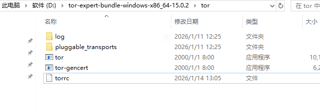
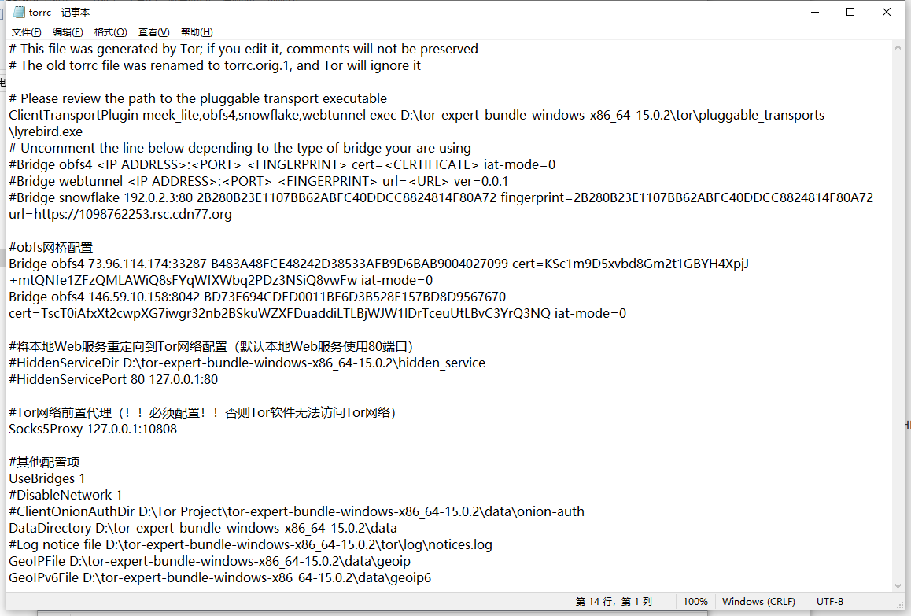
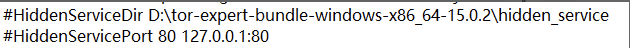
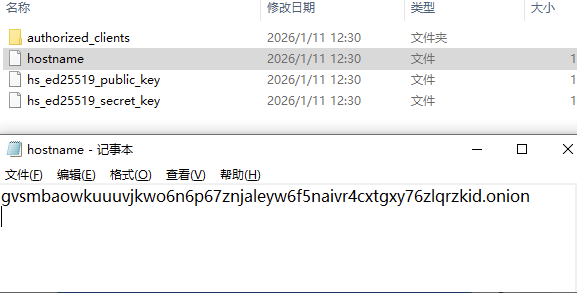
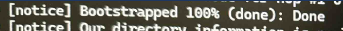
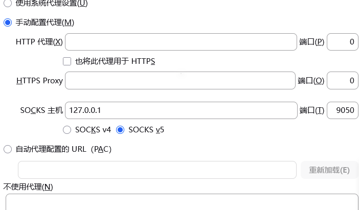
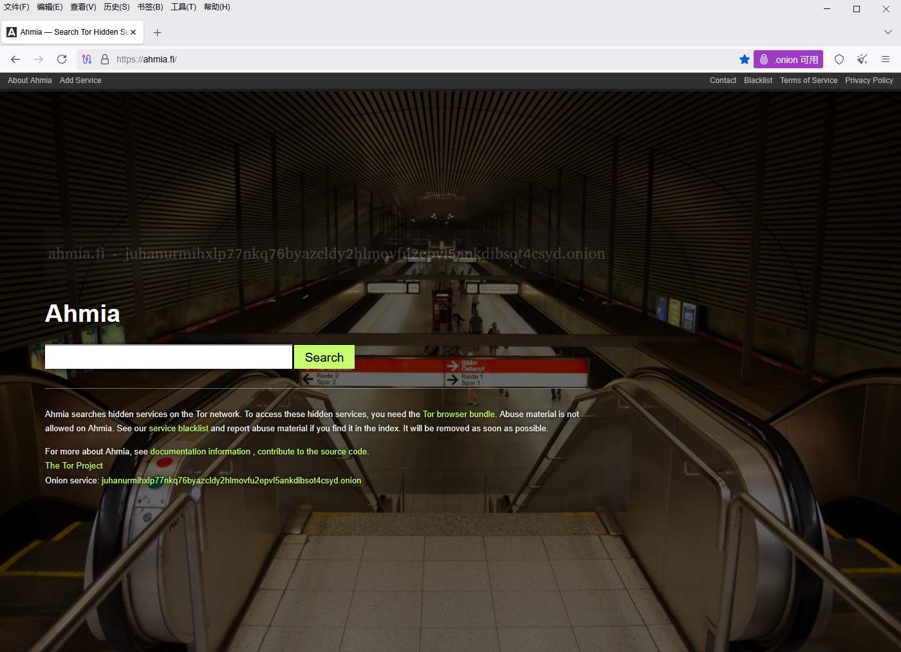
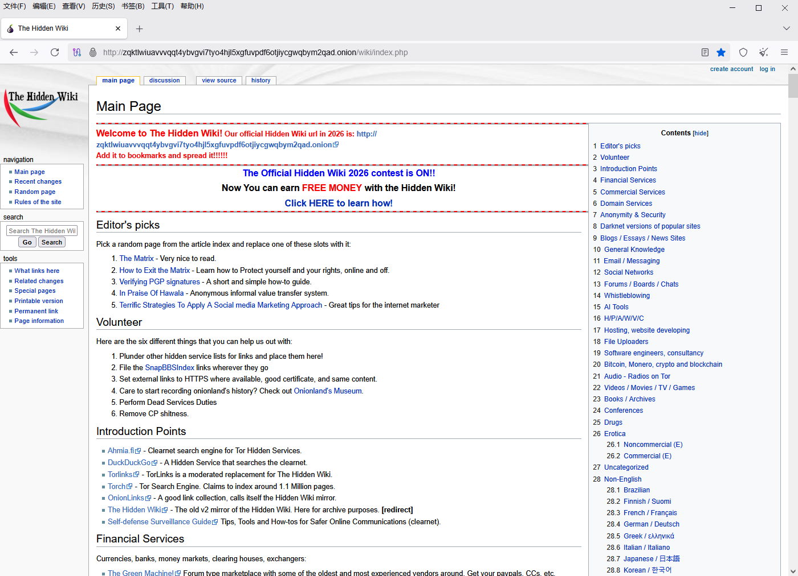

# Tor专家套件操作手册

作者：哈啰维奇技术咨询站（闲鱼、小红书店铺同名）

---

## **1.Tor网络简介**

（1）暗网属于深网（无法直接访问，比如公司内网）的一部分，是一种去中心化的加密匿名网络。一般是基于P2P网络技术的覆盖网（网络协议应用层构建），比如Tor网络和I2P网络。

（2）Tor网络为P2P网络，本身自带NAT穿透功能，可将本地web服务映射到Tor网络中。无需依赖公网IP、域名及DNS等基础设施。

其它软件也能通过Tor软件（本质为Tor软件的代理软件，Tor浏览器即为火狐浏览器集成Tor软件）的9050口访问Tor网络，从而将Tor网络作为代理。

## **2.软件下载及安装**

（1）下载tor-expert-bundle-windows-x86_64软件直接解压到D盘，我压缩时候已经建了文件夹的，不用再套文件夹。

（2）下载火狐浏览器并安装。

## **3.软件配置**

**（1）tor专家套件配置文件**

使用笔记本软件打开tor-expert-bundle-windows-x86_64-15.0.2\tor\torrc文件，torrc就是该软件配置文件。（我已经配置好obfs网桥和onion网站建站参数了）





**（2）修改配置文件-设置前置代理（VPN）**

Tor软件网桥正常工作，需要软件能访问外网，因此需要设置前置代理。设置项如下：

```
Socks5Proxy 127.0.0.1:10808
```

Tor软件前置代理设置，默认10808端口（V2rayN代理软件的代理端口），需根据VPN软件的提供的Socks5端口号进行修改。

（使用meek网桥或webtunnel似乎可以不用配置VPN代理，但是可能成功也可能失败。不使用VPN代理就在该项前面加#字符，然后将网桥项改为meek网桥或webtunnel网桥，网桥地址参见可选网桥地址）

**（3）修改配置文件-Onion网站建站设置（可选）**

HiddenServiceDir和HiddenServicePort 为将局域网web服务器映射到Tor网络中的配置项目，如果过需要在Tor网络中部署onion站点则需要设置。

```
HiddenServiceDir D:\tor-expert-bundle-windows-x86_64-15.0.2\hidden_service
HiddenServicePort 80 127.0.0.1:80
```

不需建设Onion网站要就在配置项前面加#（表示注释，软件不执行，见下图），默认是本地Web服务为80端口。需要在本地部署Web服务，建议使用PHPStudy Pro软件来搭建网站。



其中HiddenServiceDir 的路径我已经配置好了，就在软件文件路径下的hidden_service文件夹内，在Tor网络中注册网站时生成的onion地址文件（hostname）就在该目录下。



**（3）运行启动脚本**

配置好了双击“运行tor.bat”脚本，命令行出现以下项表示Tor软件配置成功

[NOTICE] Bootstrapped 100% (done): Done



**（4）配置火狐浏览器的Tor网络代理**

把火狐浏览器的网络代理改为127.0.0.1:9050，详见下图



**（6）Tor网络中的Onion网站访问**

打开火狐浏览器，输入以下测试网址（Tor网络中的洋葱站点）

**测试网站1：Ahmia搜索引擎**

http://juhanurmihxlp77nkq76byazcldy2hlmovfu2epvl5ankdibsot4csyd.onion/



**测试网站2：Hidden Wiki网站收录站**

http://zqktlwiuavvvqqt4ybvgvi7tyo4hjl5xgfuvpdf6otjiycgwqbym2qad.onion/wiki/index.php/Main_Page



---

## **4.可选网桥地址（Tor Broswer PC版和安卓版也可用）**

推荐使用obfs网桥（经过测试需要VPN才能正常使用）和meek网桥（似乎不需要VPN就能使用），但是依然推荐使用VPN作为前置代理，安全性更高。

**1.Tor Broswer内置网桥提取**

```
（1）obfs网桥
obfs4 193.11.166.194:27020 86AC7B8D430DAC4117E9F42C9EAED18133863AAF cert=0LDeJH4JzMDtkJJrFphJCiPqKx7loozKN7VNfuukMGfHO0Z8OGdzHVkhVAOfo1mUdv9cMg iat-mode=0
obfs4 146.57.248.225:22 10A6CD36A537FCE513A322361547444B393989F0 cert=K1gDtDAIcUfeLqbstggjIw2rtgIKqdIhUlHp82XRqNSq/mtAjp1BIC9vHKJ2FAEpGssTPw iat-mode=0
obfs4 193.11.166.194:27015 2D82C2E354D531A68469ADF7F878FA6060C6BACA cert=4TLQPJrTSaDffMK7Nbao6LC7G9OW/NHkUwIdjLSS3KYf0Nv4/nQiiI8dY2TcsQx01NniOg iat-mode=0
obfs4 51.222.13.177:80 5EDAC3B810E12B01F6FD8050D2FD3E277B289A08 cert=2uplIpLQ0q9+0qMFrK5pkaYRDOe460LL9WHBvatgkuRr/SL31wBOEupaMMJ6koRE6Ld0ew iat-mode=0
obfs4 85.31.186.26:443 91A6354697E6B02A386312F68D82CF86824D3606 cert=PBwr+S8JTVZo6MPdHnkTwXJPILWADLqfMGoVvhZClMq/Urndyd42BwX9YFJHZnBB3H0XCw iat-mode=0
obfs4 193.11.166.194:27025 1AE2C08904527FEA90C4C4F8C1083EA59FBC6FAF cert=ItvYZzW5tn6v3G4UnQa6Qz04Npro6e81AP70YujmK/KXwDFPTs3aHXcHp4n8Vt6w/bv8cA iat-mode=0
obfs4 37.218.245.14:38224 D9A82D2F9C2F65A18407B1D2B764F130847F8B5D cert=bjRaMrr1BRiAW8IE9U5z27fQaYgOhX1UCmOpg2pFpoMvo6ZgQMzLsaTzzQNTlm7hNcb+Sg iat-mode=0
obfs4 192.95.36.142:443 CDF2E852BF539B82BD10E27E9115A31734E378C2 cert=qUVQ0srL1JI/vO6V6m/24anYXiJD3QP2HgzUKQtQ7GRqqUvs7P+tG43RtAqdhLOALP7DJQ iat-mode=1
obfs4 209.148.46.65:443 74FAD13168806246602538555B5521A0383A1875 cert=ssH+9rP8dG2NLDN2XuFw63hIO/9MNNinLmxQDpVa+7kTOa9/m+tGWT1SmSYpQ9uTBGa6Hw iat-mode=0
obfs4 45.145.95.6:27015 C5B7CD6946FF10C5B3E89691A7D3F2C122D2117C cert=TD7PbUO0/0k6xYHMPW3vJxICfkMZNdkRrb63Zhl5j9dW3iRGiCx0A7mPhe5T2EDzQ35+Zw iat-mode=0
obfs4 85.31.186.98:443 011F2599C0E9B27EE74B353155E244813763C3E5 cert=ayq0XzCwhpdysn5o0EyDUbmSOx3X/oTEbzDMvczHOdBJKlvIdHHLJGkZARtT4dcBFArPPg iat-mode=0
（2）snowflake网桥地址
snowflake 192.0.2.4:80 8838024498816A039FCBBAB14E6F40A0843051FA fingerprint=8838024498816A039FCBBAB14E6F40A0843051FA url=https://1098762253.rsc.cdn77.org/ fronts=app.datapacket.com,www.datapacket.com ice=stun:stun.epygi.com:3478,stun:stun.uls.co.za:3478,stun:stun.voipgate.com:3478,stun:stun.mixvoip.com:3478,stun:stun.nextcloud.com:3478,stun:stun.bethesda.net:3478,stun:stun.nextcloud.com:443 utls-imitate=hellorandomizedalpn
snowflake 192.0.2.3:80 2B280B23E1107BB62ABFC40DDCC8824814F80A72 fingerprint=2B280B23E1107BB62ABFC40DDCC8824814F80A72 url=https://1098762253.rsc.cdn77.org/ fronts=app.datapacket.com,www.datapacket.com ice=stun:stun.epygi.com:3478,stun:stun.uls.co.za:3478,stun:stun.voipgate.com:3478,stun:stun.mixvoip.com:3478,stun:stun.nextcloud.com:3478,stun:stun.bethesda.net:3478,stun:stun.nextcloud.com:443 utls-imitate=hellorandomizedalpn
（3）Meek网桥地址
meek_lite 192.0.2.20:80 url=https://1603026938.rsc.cdn77.org front=www.phpmyadmin.net utls=HelloRandomizedALPN
```

**2.通过Telegram机器人获取的网桥**

```
obfs4 176.137.174.10:8090 995A93BEB143ABB7F676263E75FFE8019B137FC0 cert=uIrjy0RYiPVD/muZ2Jj7bAYOm6DH6MprvIC30TdGvq2P8RG3z6sVl4aqbTahNQIS/Ll7WQ iat-mode=0
obfs4 83.135.89.215:49152 86A8801C84255EC714EF2AD4E4E665598800ABEF cert=8RNrsuwoQ64SLAKW920a64pjS9reyzhn6q3K3iYZc4ij21r8k8vVGRFpcNlsB+51VJR7Lw iat-mode=0
obfs4 57.128.56.248:30285 1CF4ED5D3C7F4E3BFB485DDA5C7E688BEBBAE9DA cert=wC6H6x0IDrTeIKVqOzzDAfZQxU6eyB2Eg/auzam+XCMWzQLHl3+qfgbqhMQxV7K3uQRMZw iat-mode=0
obfs4 51.68.81.140:2098 F205CB5B969389061477609F8E03470B982F64C1 cert=6hFyrclX8Cg16jHGbtYqZxbGxj+p0flBn2EYZu+hvx/tGL4GROXSvBtwVQ1sRYFbi0++fQ iat-mode=0

webtunnel [2001:db8:cf6:ce7:c7fc:5a42:72d5:8c8b]:443 D0A1F802127A925F47A7C9713F17A9E1D1292E54 url=https://cdn-131.airstrip1.net/4c5d6e7f8g9h0i1j2k3l4m5n ver=0.0.2
webtunnel [2001:db8:e026:e32:d3ef:1ddf:4a96:4386]:443 25E15F4A7E69AAF062B8353C4C37DD35D5417837 url=https://app04.oneclickhost.eu/dLHKfx5cEep0SWfJCLQqIBGF ver=0.0.3
webtunnel [2001:db8:5506:f98f:b625:c162:4821:ba21]:443 90A7AFFBFE51BD4DABE327FD2E1D8DEB31AF7071 url=https://mail.engelseruiter.nl/oZL7sdW588guQ6pLrMpIZ9fs ver=0.0.3
webtunnel [2001:db8:1640:379c:ad30:db5f:bff5:37d0]:443 AF8F7548C886D6F53A652411DBB71D089517085A url=https://app05.oneclickhost.eu/alpfZGTB9FckCgOkOOA0OHlh ver=0.0.3
```

**3.获取网桥方式：**
（1）Telegram机器人：https://t.me/GetBridgesBot
（2）网页：bridges.torproject.org
（3）发送邮件至 bridges@torproject.org，使用Gmail 或 Riseup
（4）Tor 浏览器中通过网桥机器人获取网桥
